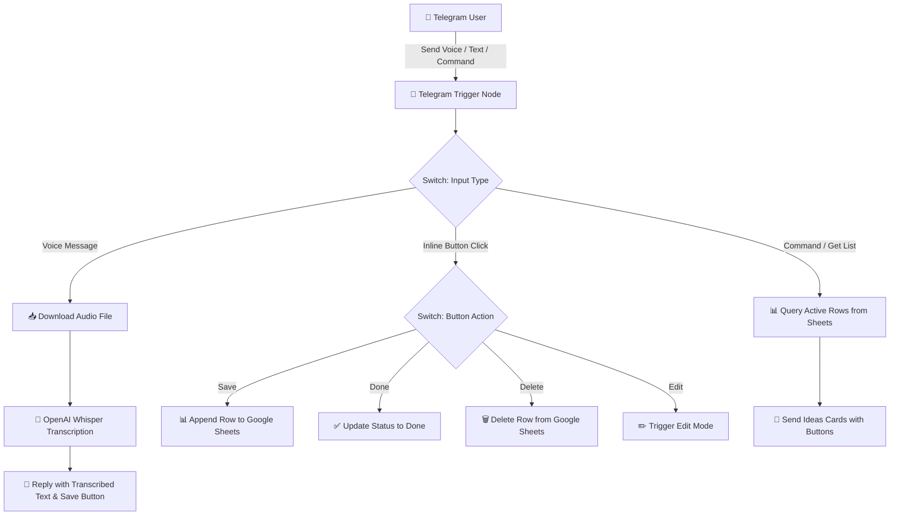

# 🎙️ Telegram AI Voice & Text Assistant (n8n Workflow)

An intelligent personal assistant powered by **n8n**, **OpenAI Whisper**, and **Telegram**. Capture your thoughts on the go — simply send a voice or text message to your private Telegram bot, and it will automatically transcribe, structure, and save your ideas into a **Google Spreadsheet** with interactive management buttons.

---

## ✨ Key Features

- 🎙️ **Voice-to-Text Transcription**: Automatically transcribes Telegram voice messages into high-accuracy text using **OpenAI Whisper**.
- 📥 **One-Click Saving**: Review transcriptions in chat and save them instantly to Google Sheets.
- 📋 **Task & Idea Dashboard**: Retrieve active (uncompleted) ideas directly in Telegram rendered as interactive inline keyboard cards.
- ✏️ **In-Chat Editing**: Modify any saved idea by replying with updated text or a new voice message.
- ✅ **Status Tracking**: Mark ideas as `Done` or `Delete` them right from Telegram.
- 🔒 **Privacy-First**: Operates on your self-hosted or cloud n8n instance with your private API credentials.

---

## 📐 Architecture & Workflow Diagram

---

## 🛠️ Prerequisites

Before installing the workflow, ensure you have:

1. An active **n8n** instance (Self-hosted or n8n Cloud).
2. A **Telegram Bot Token** (created via [@BotFather](https://t.me/BotFather)).
3. An **OpenAI API Key** (for Whisper speech-to-text).
4. A **Google Account** with access to Google Drive & Google Sheets.

---

## 🚀 Setup & Installation Guide

### Step 1: Prepare the Google Spreadsheet

1. Create a new Google Spreadsheet named **`My Ideas`**.
2. Rename the first tab/sheet to **`Ideas`**.
3. Create the following column headers in Row 1:

| A | B | C | D | E |
|---|---|---|---|---|
| **ID** | **Date** | **Note** | **Status** | **TelegramMsgID** |

4. Copy your **Spreadsheet ID** from the browser URL:
   `https://docs.google.com/spreadsheets/d/`**`YOUR_SPREADSHEET_ID`**`/edit`

---

### Step 2: Import the Workflow into n8n

1. Download the [`workflow.json`](./workflow.json) file from this repository.
2. Open your **n8n canvas**.
3. Click **Workflows** -> **Import from File** (or press `Ctrl+V` to paste the raw JSON).

---

### Step 3: Configure Credentials in n8n

Assign your API credentials to the corresponding nodes:

1. **Telegram Credentials**:
   - Double-click the **Telegram Trigger** node.
   - Add your `Telegram API` credential using your Bot Token.
2. **OpenAI Credentials**:
   - Double-click the **Transcribe Voice (OpenAI)** node.
   - Add your `OpenAI API` credential with your API key.
3. **Google Sheets Credentials**:
   - Double-click any **Google Sheets** node.
   - Authorize via `Google Sheets OAuth2 API`.

---

### Step 4: Set Your Spreadsheet ID in Nodes

Replace the placeheld `YOUR_SPREADSHEET_ID_HERE` with your actual Google Spreadsheet ID across the following Google Sheets nodes:
- `Append row in sheet`
- `Get row(s) in sheet`
- `Update Status`
- `Get row for Delete`
- `Delete Idea`
- `Update row Text`
- `Update row Voice`

---

### Step 5: Activate the Workflow

Toggle the workflow status switch in the top-right corner of n8n to **Active**.

---

## 💡 How to Use

1. **Record a Voice Note**: Send a voice message in your Telegram bot chat. The bot will send back the transcription with a `💾 Save` button.
2. **Save Note**: Tap `💾 Save` to record it in your Google Sheet with status `New`.
3. **View Active Ideas**: Type any command or text to fetch uncompleted ideas.
4. **Manage Tasks**:
   - Tap `✅ Done` to mark an idea as complete.
   - Tap `🗑 Delete` to remove it.
   - Tap `✏️ Edit` to overwrite the note with new text or voice.

---

## 🤝 Contributing

Contributions, issues, and feature requests are welcome! Feel free to check the [issues page](../../issues).

---

## 📄 License

This project is licensed under the [MIT License](LICENSE).
